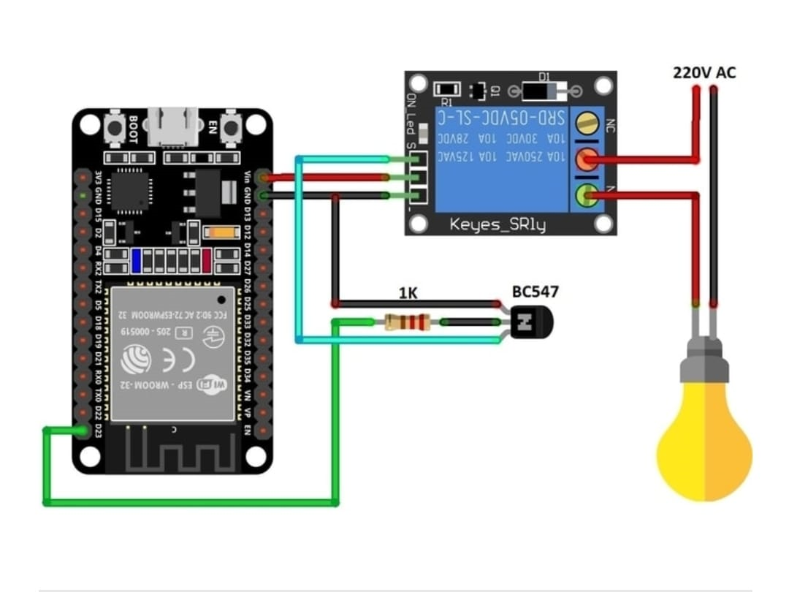

# aws-home-automation-system
AWS IoT Core-based home automation system using ESP32/ESP8266.
# AWS-Based Home Automation System

This project demonstrates a simple home automation system using ESP32/ESP8266 microcontroller and AWS IoT Core for cloud-based monitoring and control.

## 🚀 Features

- Real-time monitoring of home appliances (e.g., lights, fans, AC).
- Remote control via MQTT.
- Data visualization (if integrated with a dashboard).
- Secure communication using AWS IoT Core.

## 🛠️ Tech Stack

- **Hardware**: ESP32 / ESP8266 microcontroller.
- **Cloud**: AWS IoT Core, AWS Lambda (optional).
- **Communication**: MQTT protocol.
- **Language**: C++ (Arduino framework).

## 📁 Project Structure

- `device-code/`: Microcontroller code.
- `cloud-setup/`: AWS IoT setup guides, Lambda functions, MQTT topics.
- `docs/`: Architecture diagrams, detailed setup guides.

## ⚙️ How to Set Up

1. **Hardware Setup**:
   - Connect sensors and actuators to ESP32.
   - Flash `device-code/esp32/main.ino` using Arduino IDE.

2. **AWS IoT Core**:
   - Create a "Thing" in AWS IoT.
   - Attach a policy and download certificates.
   - Update `secrets.h` with your device's credentials.

3. **MQTT Topics**:
   - Publish/subscribe topics as per `cloud-setup/mqtt-topics.md`.

4. **(Optional) Lambda Integration**:
   - Use `cloud-setup/lambda-function.js` to process data or send alerts.

## 📝 Documentation

Find setup instructions and architecture diagram in the `docs/` folder.

## 📸 Screenshot / Architecture

## 🤝 Contributing

Feel free to fork this repo, submit pull requests, or suggest enhancements!

---

**License**: [MIT](LICENSE)
